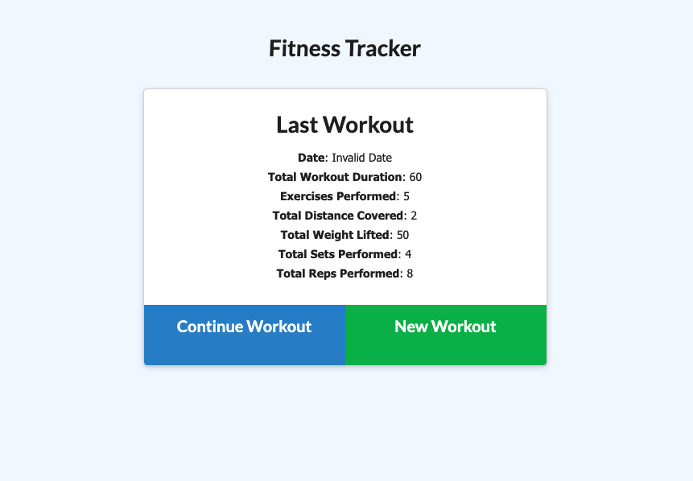
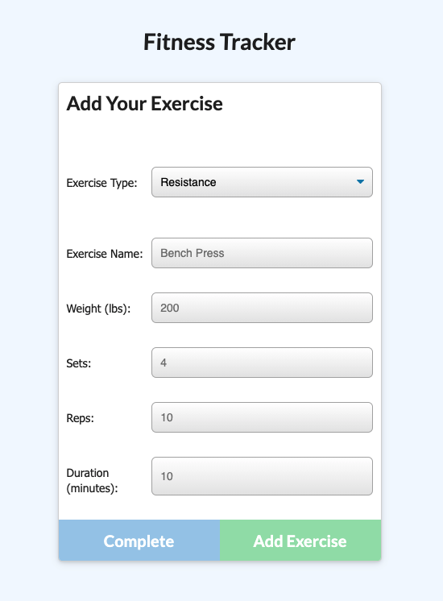
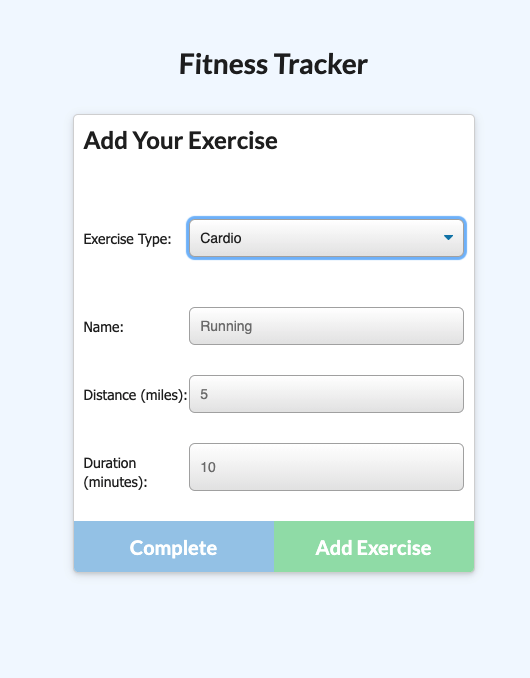
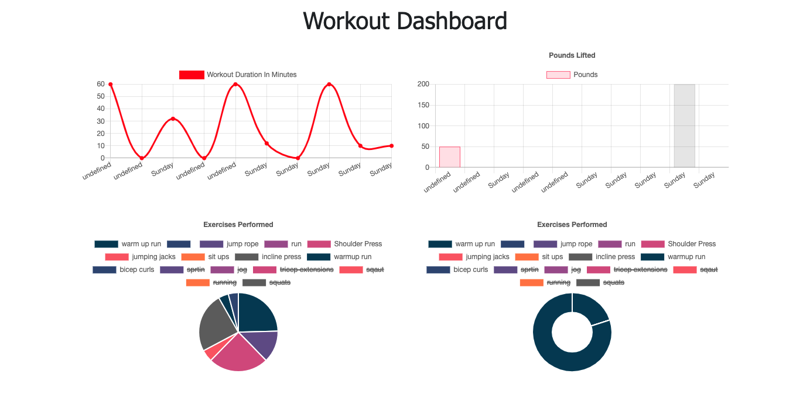
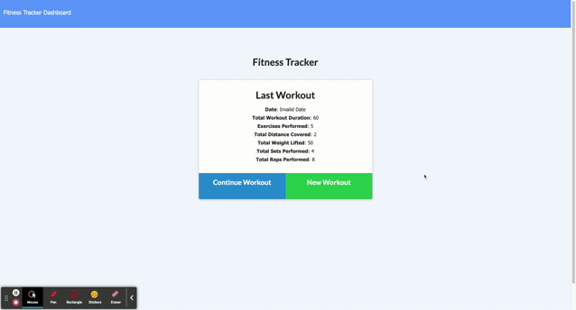

# **Workout Tracker**

## **Table of Contents**
---
* [Description](#description)
* [Links](#links)
* [Sources-Tech](#sources-tech)

## **Description**
---
An application that allows a user to track their workouts, and create new ones!

## **Links**
---
Deployed Application: https://blooming-beach-10167.herokuapp.com/

Github Repo: https://github.com/dylanjacobb/workout-tracker

## **Track Your Workouts**
---

## Add a resistance exercise

## Add a cardio exercise

## Review your workout analytics on the dashobard

## Add to already existing workouts 

  ## **Sources-Tech**
  ---
* how to sort - https://docs.mongodb.com/manual/reference/operator/aggregation/addFields/#mongodb-pipeline-pipe.-addFields
* how to use aggregates - https://docs.mongodb.com/manual/reference/operator/aggregation/sort/
